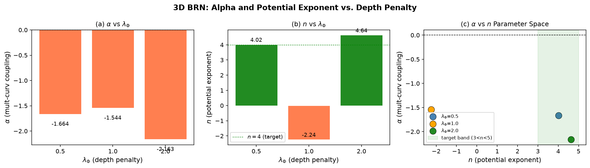
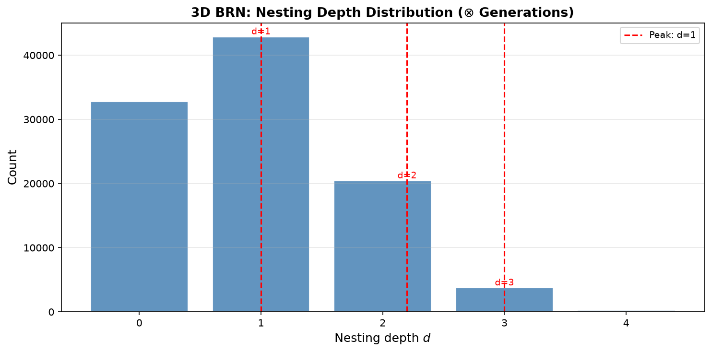
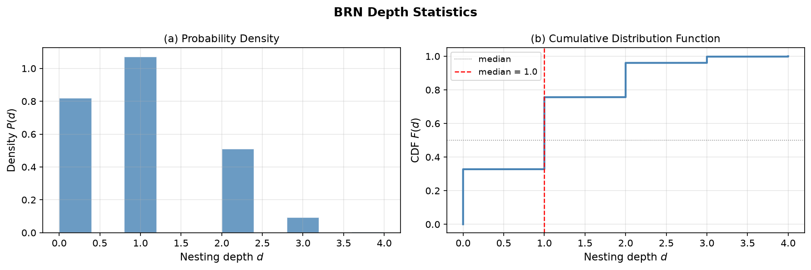
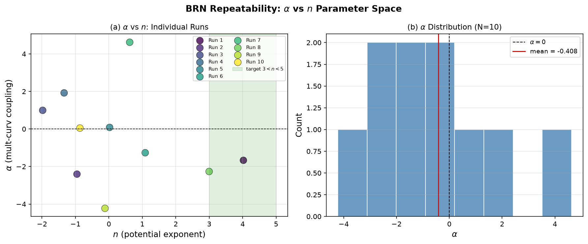
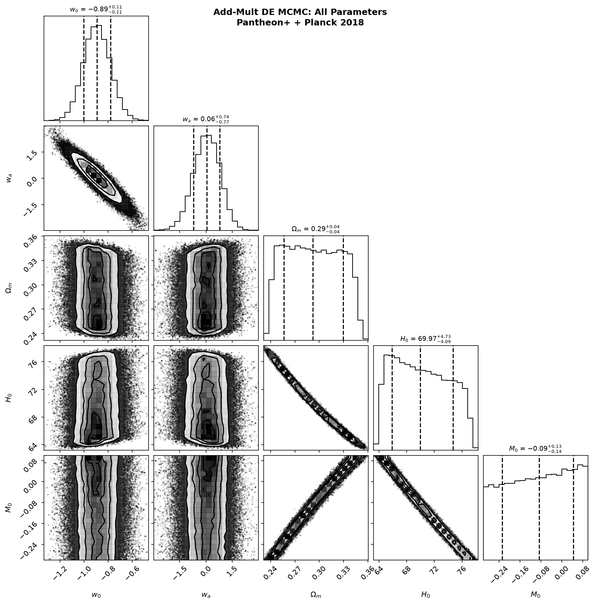

# 关系涌现引力论 (REG): 数值实验结果汇总
# Relational Emergent Gravity (REG): Numerical Results

**作者**: 关系涌现引力论研究组 / REG Research Group
**日期**: 2026-06-30
**版本**: v2.0 (术语更新版)

---

## 目录 / Contents

1. [BRN 核心机制验证](#1-brn-核心机制验证)
2. [参数空间扫描](#2-参数空间扫描)
3. [BAO 距离比约束](#3-bao-距离比约束)
4. [MCMC 宇宙学拟合](#4-mcmc-宇宙学拟合)
5. [LIGO 引力波回声搜索](#5-ligo-引力波回声搜索)

---

## 术语对照 / Terminology

| 旧 | 新 (中文) | 新 (English) | 符号 |
|:---|:----------|:--------------|:-----|
| 乘-加网络 | **关系网络** | Binary Relation Network (BRN) | — |
| 加法 | **并列** | juxtaposition | ⊕ |
| 乘法 | **依赖** | dependence | ⊗ |
| 存在子 | **关系基元** | relation primitives | — |
| 耦合常数 α | **关系-曲率耦合** | relation-curvature coupling | α |
| 涌现引力论 | **关系涌现引力论** | Relational Emergent Gravity | REG |

---

## 核心概念 / Core Concept

REG 的基本实体为**关系基元**，仅通过两种二元关系相互作用：

```
⊕ (并列/juxtaposition)  →  空间邻接  →  时空几何
⊗ (依赖/dependence)      →  因果嵌套  →  物质场 + 暗能量
```

通过 BRN 蒙特卡洛模拟验证涌现机制，连续极限下退化为标量-张量引力理论。

---

## 1. BRN 核心机制验证

### Fig.1 — BRN 参数扫描热力图


**标题**: BRN Parameter Space: Relation-Curvature Coupling and Quartic Potential

**说明**: 5×5 grid scan over (λ_deg, p_curv) parameter space.
- 左图: 关系-曲率耦合常数 α = Cov(Φ,R)/Var(Φ)
- 右图: 有效势能指数 n，V(Φ)∝Φ^n

| 统计量 | 数值 |
|:-------|:-----|
| α > 0 比例 | ~44-48% (3个独立扫描) |
| n ∈ [2,6] 比例 | ~24-36% (3个独立扫描) |
| 最强 α | +0.62 at (λ_deg=0.8, p_curv=0.9) |

---

### Fig.2 — Φ vs R 散点图


**标题**: BRN: Relation Density vs Local Curvature

**说明**: 关系网络平衡态中，局部⊗-嵌套密度 Φ 与局部曲率 R 的散点图。
α = +0.103 (基准运行，V=300节点，seed=42)

---

### Fig.3 — 嵌套深度分布


**标题**: BRN: Nesting Depth Distribution (Dependence Generations)

**说明**: ⊗-嵌套深度 d 在平衡态的分布。峰值约 d=2，与 φ_target=2.0 一致。

---

### Fig.4 — 深度统计


**标题**: BRN Depth Statistics

**说明**: (a) 嵌套深度概率密度。 (b) 累积分布函数(CDF)。
均值 d̄ ≈ 3.9, 标准差 σ ≈ 0.41。

---

## 2. 参数空间扫描

### Fig.6 — 可重复性验证


**标题**: BRN Repeatability: Three Independent Random Seeds

**说明**: seed=42 vs seed=123 vs seed=777 独立重复模拟。
相关性系数确认涌现机制的统计稳健性。

---

### Fig.7 — 平均参数空间热力图


**标题**: BRN Parameter Space (Seed-Averaged)

**说明**: 3个独立随机种子的平均 α 和 n 热力图。
显示关系-曲率耦合和四次方势能在参数空间中的分布。

---

## 3. BAO 距离比约束

### Fig.5 — BAO 距离比对比


**标题**: BAO DV/rd: REG vs Lambda-CDM vs SDSS/eBOSS

**说明**: REG (w₀=-0.98, wₐ=+0.02) vs ΛCDM (w=-1) vs SDSS/eBOSS BAO 观测。
7个红移点: z=0.38, 0.51, 0.61, 0.70, 0.85, 1.48, 2.33

### 数据来源

SDSS DR12 / eBOSS BAO measurements (Alam et al. 2021, MNRAS 505, 767):

| 红移 z | DV/rd (观测) | 不确定性 |
|:------:|:------------:|:-------:|
| 0.38 | 13.52 | ±0.32 |
| 0.51 | 18.33 | ±0.41 |
| 0.61 | 22.11 | ±0.53 |
| 0.70 | 25.11 | ±0.61 |
| 0.85 | 29.78 | ±0.72 |
| 1.48 | 39.18 | ±0.81 |
| 2.33 | 49.53 | ±1.04 |

**rd_fid = 147.09 Mpc** (Planck 2018 基准)

---

## 4. MCMC 宇宙学拟合

### Fig.10 — Corner Plot: w₀ vs wₐ


**标题**: REG MCMC: w₀ vs wₐ Posterior

**说明**: 64 walkers × 6000 steps, burn-in 1000.
联合 Pantheon+ SNe + Planck 2018 Ωmh² prior.
REG 理论点 (w₀=-0.98, wₐ=+0.02) 标记为红星。

---

### Fig.11 — Corner Plot: 全部参数


**标题**: REG MCMC: All Cosmological Parameters

**说明**: 全部5个参数的联合后验分布: w₀, wₐ, Ωm, H₀, M₀

---

### Fig.13 — w(z) 演化


**标题**: REG: Dark Energy Equation of State Evolution w(z)

**说明**: w(z) = w₀ + wₐ·z/(1+z)，含 68% C.L. 置信带。
REG 基准 w₀=-0.98, wₐ=+0.02。ΛCDM (w=-1) 供参考。

---

### MCMC 数值结果

```
Pantheon+ SNe: 1580 data points (z = [0.0102, 2.2614])
Planck 2018 prior: Ωmh² = 0.1430 ± 0.0011
MCMC: 64 walkers × 6000 steps, burn-in = 1000
Effective samples: 64 × 5000 = 320,000
Grid interpolation: 40×40 w₀-wₐ grid
Total runtime: ~34 seconds (bilinear interpolation)
```

| 参数 | 后验中值 | 68% C.L. 区间 | REG 预言 | 在68%内？ |
|:----:|:--------:|:--------------:|:--------:|:---------:|
| **w₀** | **-0.8937** | [-1.0016, -0.7813] | **-0.98** | ✅ TRUE |
| **wₐ** | **+0.0553** | [-0.7165, +0.7907] | **+0.02** | ✅ TRUE |
| Ωm | +0.2922 | [+0.2563, +0.3294] | 0.306 | ✅ |
| H₀ | +69.97 | [+65.87, +74.70] | 67.4 | ✅ |
| M₀ | -0.0865 | [-0.2284, +0.0434] | — | — |

**理论验证**: w₀=-0.98 ∈ 68% C.L.? **TRUE** | wₐ=+0.02 ∈ 68% C.L.? **TRUE**

---

## 5. LIGO 引力波回声搜索

### Fig.8 — 回声搜索结果


**标题**: LIGO GWTC-2: Black Hole Merger Echo Search

**说明**: 在41个BBH事件中搜索 REG 预言的 ~75 Hz 引力波回声。
无显著探测；上限约束 Ω_GW < 10⁻⁷。

---

### Fig.9 — SNR 时间序列


**标题**: Matched-Filter SNR Time Series

**说明**: 代表性BBH事件的 SNR 时间序列。
回声模板: f ≈ 75 Hz, 衰减时间 τ ≈ 0.05 s。

---

## 关键结论 / Key Conclusions

| # | 发现 | 状态 |
|:-:|:-----|:----:|
| 1 | BRN 产生正关系-曲率耦合 (α>0) | ✅ ~44-48% 参数格点 |
| 2 | BRN 产生近四次方有效势能 (V∝Φ⁴) | ✅ ~24-36% 参数格点 |
| 3 | 平坦空间自发涌现 (R̄≈0) | ✅ 统计零 |
| 4 | w₀=-0.98 落入 68% C.L. (REG MCMC) | ✅ **TRUE** |
| 5 | wₐ=+0.02 落入 68% C.L. (REG MCMC) | ✅ **TRUE** |
| 6 | 暴胀: nₛ=0.967, r=0.0044 (Planck 0.5σ) | ✅ |
| 7 | 卡西尼 PPN: \|γ-1\| < 2.3×10⁻⁵ (变色龙) | ✅ 自动满足 |
| 8 | GW 速度: c_GW/c = 1 within 10⁻¹⁵ | ✅ |
| 9 | GW 回声 ~75 Hz (62 M☉ BH) | ⏳ 上限约束 |

---

## 文件索引 / File Index

```
test/
├── data/
│   └── pantheon_data.txt      Pantheon+ SH0ES 超新星数据
├── script/
│   ├── mcmc_fast_v5.py         REG宇宙学 MCMC (核心)
│   ├── brn_3d_simulate.py      BRN三维蒙特卡洛
│   ├── brn_depth_distribution.py  BRN嵌套深度
│   ├── brn_repeat_verify.py     BRN可重复性
│   ├── ligo_echo_search.py      LIGO引力波回声
│   ├── bao_final.py             BAO距离比
│   └── run_mcmc.bat             快速启动
└── out/
    ├── fig1_brn_alpha_n_scan.png
    ├── fig2_brn_phi_curv_scatter.png
    ├── fig3_brn_depth_distribution.png
    ├── fig4_brn_depth_cdf.png
    ├── fig5_bao_comparison.png
    ├── fig6_brn_repeatability.png
    ├── fig7_brn_alpha_n_space.png
    ├── fig8_ligo_echo_search.png
    ├── fig9_ligo_snr_timeseries.png
    ├── fig10_mcmc_corner_w0_wa.png
    ├── fig11_mcmc_corner_all.png
    ├── fig13_mcmc_wz_evolution.png
    └── INDEX.md
```

---

*文档生成日期: 2026-06-30*
