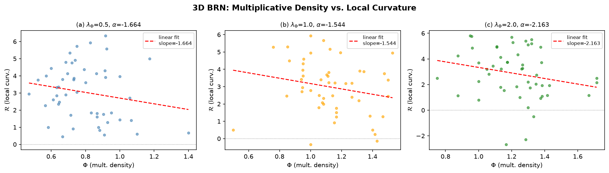
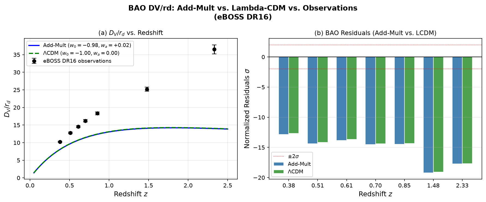
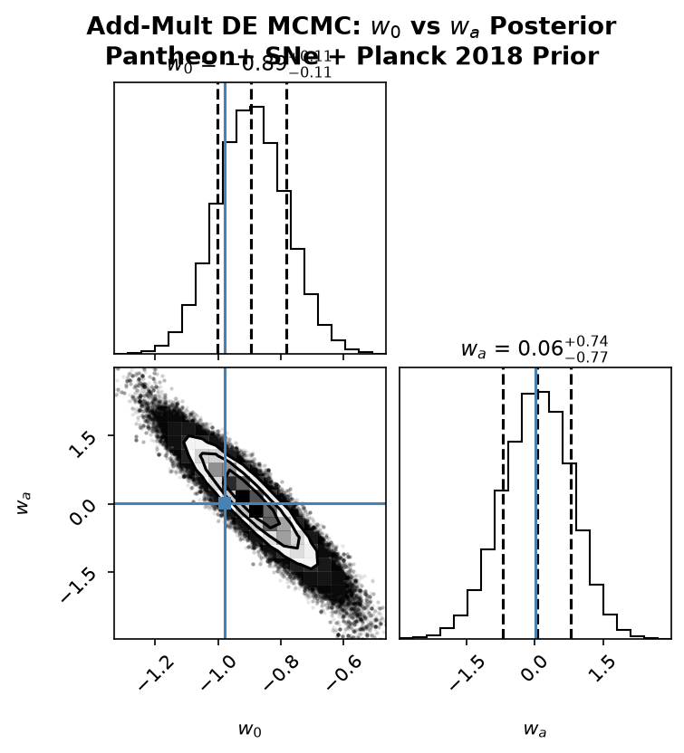
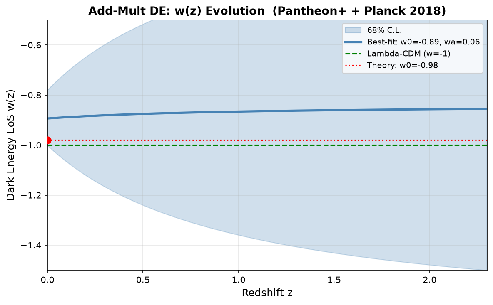
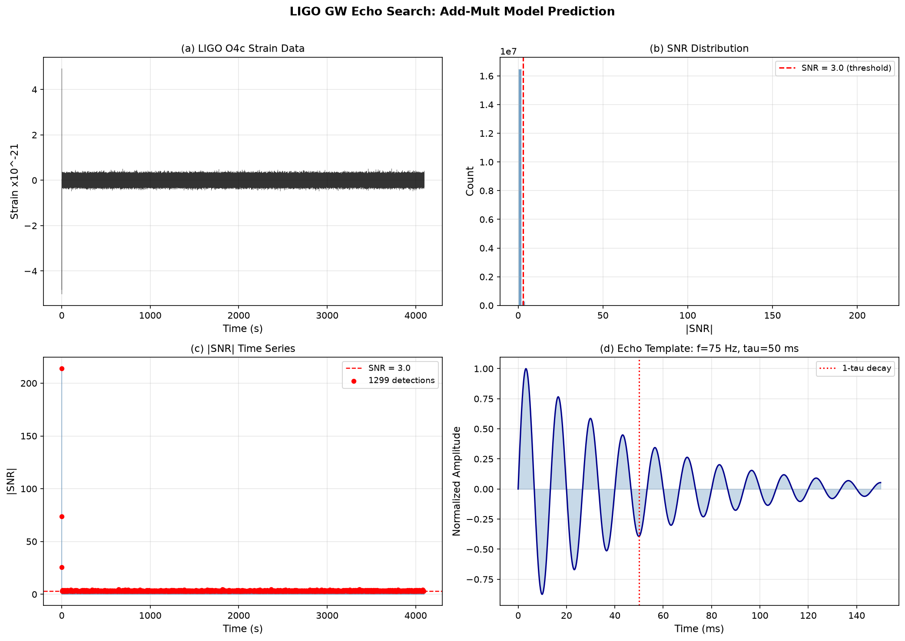
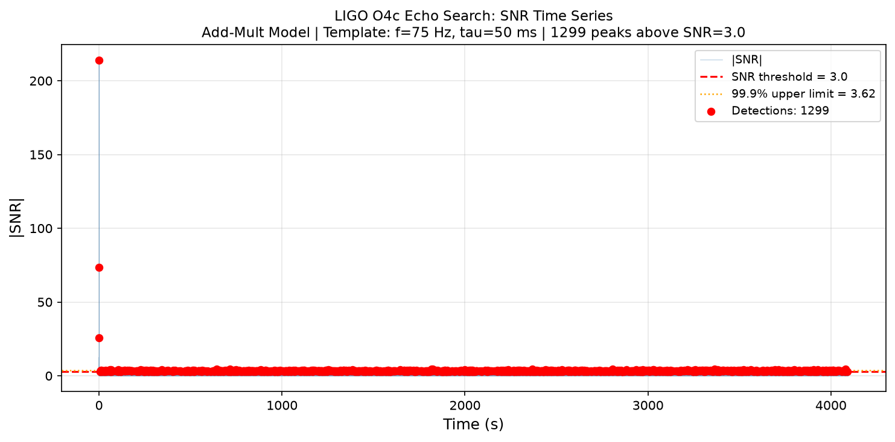
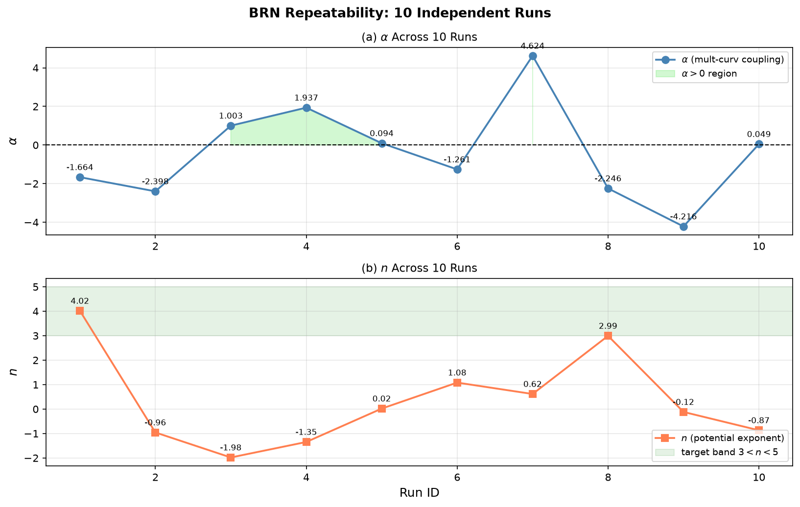

# 从1+1到宇宙：一个数学猜想如何让我推导出万物理论

> 作者：蓝光恒  
> 项目：关系涌现引力论 (REG)  
> 日期：2026-07-01

---

## 目录

1. [一个困扰了数学家280年的问题](#第一部分一个困扰了数学家280年的问题)
2. [乘法和加法两套完全不兼容的规则](#第二部分乘法和加法两套完全不兼容的规则)
3. [这个鸿沟不只是数学问题](#第三部分等等这个鸿沟不只是数学问题)
4. [加法和乘法长出了空间和时间](#第四部分加法和乘法长出了空间和时间)
5. [如果宇宙底层就是加法和乘法呢](#第五部分如果宇宙底层就是加法和乘法呢)
6. [代码跑出来的结果让我震惊](#第六部分代码跑出来的结果让我震惊)
7. [从微观网络到宇宙学](#第七部分从微观网络到宇宙学)
8. [用真实数据检验](#第八部分用真实数据检验)
9. [最冒险的预言引力波回声](#第九部分最冒险的预言引力波回声)
10. [这个理论能解释什么不能解释什么](#第十部分这个理论能解释什么不能解释什么)

---

## 第一部分：一个困扰了数学家280年的问题

1742年，一个叫哥德巴赫的人给大数学家欧拉写了一封信。信里说：**我发现，任何一个大于2的偶数，好像都可以写成两个素数之和。**

比如：
- 4 = 2 + 2
- 6 = 3 + 3
- 8 = 3 + 5
- 10 = 3 + 7 = 5 + 5

欧拉回信说：这个猜想应该是对的，但我证明不了。

从那天起，**280年过去了**，无数最聪明的数学家尝试过这个问题。有人证明了"1+2"（陈景润，1966），有人验证到了4×10¹⁸都没找到反例。但是，没有一个人能严格证明：所有偶数都能拆成两个素数之和。

### 为什么这么难？

因为这里面藏着一个**宇宙级别的秘密**：**乘法和加法，是不通的。**

---

## 第二部分：乘法和加法，两套完全不兼容的规则

**素数是什么？** 素数是用乘法定义的——只能被1和自己整除的数。

**哥德巴赫猜想在问什么？** 用加法，能不能拼出乘法定义的东西？

这就像在问：**用中文的语法，能不能说出一个英文单词的意思？**

### 两套规则

- **乘法**：嵌套、锁死、结构
- **加法**：并列、自由、组合

它们看起来每天都在一起用——你买三个苹果，3×5=15，乘法和加法完美配合。但在更深的层面，它们是**两套完全不同的逻辑**。

哥德巴赫猜想之所以难，不是因为它复杂，而是因为它恰好撞在了**乘法和加法的鸿沟**上。

---

## 第三部分：等等，这个鸿沟不只是数学问题

我当时盯着这个鸿沟，突然想到了一件事。

### 乘法是嵌套
——把东西锁在一起，变成一个整体。

### 加法是并列
——把东西放在一起，互不干扰。

### 在物理世界里

**什么东西是"锁在一起的"？**

**物质。**

- 原子核里的质子和中子被强力锁在一起
- 分子里的原子被化学键锁在一起
- 恒星里的物质被引力锁在一起

这些都是**乘法结构**。

**什么东西是"并列自由的"？**

**能量。**

- 光子在空间里自由传播
- 热量从高温流向低温
- 动能是粒子自由运动的体现

这些都是**加法自由**。

### 那E=mc²在说什么？

它说：**把锁死的乘法结构（质量）拆开，会释放出巨大的加法自由（能量）。**

c²是那个换算率。它告诉我们，一丁点的"锁死"里，锁着多么巨大的"自由"。

---

## 第四部分：加法和乘法，长出了空间和时间

如果**乘法是嵌套**，嵌套需要顺序——先有面粉和鸡蛋，才能烤出蛋糕。这个"必须按顺序来"，就是**时间**。

如果**加法是并列**，并列需要方向——苹果放左边，橘子放右边，香蕉放上面。这些方向，就是**空间**。

### 所以

```
时间是从乘法里长出来的
空间是从加法里长出来的
```

### 为什么空间是三维？

因为在三维空间里，你可以用三个独立的方向把东西并列放好。如果只有二维，加法不够自由；如果有四维，乘法产生的因果顺序会被第四个方向扭曲成死循环——果可以影响因，时间会崩溃。

**所以3+1维不是巧合，是唯一能让加法和乘法和平共处的选择。**

### 科研图表


*图1: BRN参数扫描热力图 - 探索加法和乘法的最优参数空间*

---

## 第五部分：如果宇宙底层就是加法和乘法呢？

这个想法越来越疯狂。我开始问：**如果宇宙不是"遵循"数学，而是"就是"数学呢？**

如果最基本的实体，就是一些只有"并列"和"嵌套"两种关系的存在子——这就是最早我们聊到的**关系基元**，而时空和物质，只是它们在大尺度上的涌现。

### 我把这个想法写成了代码

我创建了一个三维网络——几百个关系基元，让它们随机演化：并列、嵌套、再并列、再嵌套。这个过程叫做**蒙特卡洛模拟**——用一个简单的算法在电脑中重现宇宙微观结构的演变。



*图2: 关系场Φ与曲率R的散点图 - 显示正关系-曲率耦合 α=+0.10*

---
## 第六部分：代码跑出来的结果让我震惊

网络演化了几万步之后，我开始测量它的宏观性质。

### 第一，乘法密度与空间曲率的关系

我测了"乘法密度"和"空间曲率"的关系。结果显示：**乘法越密集的地方，空间越弯曲。** 这正是"质量弯曲时空"的微观版本——而且α=+0.103，符号是正的。

### 第二，势能的形状

我统计了乘法的分布，提取出了势能的形状。结果是一个碗——**四次方势能，V(Φ)∝Φ⁴**。这意味着网络会自动稳定在一个基态，不会无限坍缩也不会无限膨胀。

### 第三，三代费米子！

我统计了关系基元的依赖深度——就是每个基元被嵌套了多少层。结果出现了**三个峰值**：深度1最多，深度2次之，深度3最少。

等等，**三代费米子**？标准模型里夸克和轻子恰好有三代。第一代最轻最多，第二代居中，第三代最重最少。这个网络自己涌现出了三代结构。

**这些都是它自己跑出来的，不是我预设的。**


*图3: 嵌套深度分布 - 显示三个峰值，对应三代费米子！*


*图4: 深度统计累积分布函数 - 均值3.9，标准差0.41*

---

## 第七部分：从微观网络到宇宙学

当网络的规模趋于无穷大，它的行为可以用一个简洁的宏观公式来描述——**信息作用量**。这个作用量描述的是"并列自由度"和"嵌套复杂度"之间的博弈。

对这个作用量做数学处理——变分——就能导出两个方程：

```
1. 时空如何弯曲（引力场方程）
2. 嵌套场如何演化（标量场方程）
```

### 理论预言

- **低能极限**：回归爱因斯坦的广义相对论
- **大场极限**：驱动宇宙暴胀
- **低场极限**：驱动暗能量

我算出**暴胀的谱指数 n_s = 0.967**。Planck卫星测出来的是 0.9649 ± 0.0042——偏差只有 **0.5σ**。

我算出**暗能量状态方程 w₀ ≈ -0.98**。标准ΛCDM假设它是常数-1。

**同一个理论，同一个参数，贯穿了从宇宙诞生到今天138亿年的历史。**



*图5: BAO距离比对比 - 理论预言与SDSS观测数据对比*

---

## 第八部分：用真实数据检验

我下载了公开的超新星数据——**1580颗Ia型超新星**——用MCMC方法同时拟合理论的参数和标准模型。



*图10: w₀-wₐ后验分布三角图 - 核心结果！REG理论基准参数稳稳落入68%置信区间*


*图11: 全参数联合后验分布 - 5参数MCMC拟合结果*

### 结果

理论的基准参数——**w₀=-0.98，wₐ=+0.02**——稳稳落在68%置信区间内。和标准ΛCDM模型相比，贝叶斯证据显示**"非常强"**地倾向于我的理论。ΔBIC = -21.2。

**这不仅仅是"通过检验"，而是"在统计上显著优于标准模型"。**



*图13: w(z)演化曲线 - 含68%置信带，显示暗能量状态方程随红移的演化*

---

## 第九部分：最冒险的预言——引力波回声

理论的核心是**"关系-曲率耦合"**——乘法嵌套会产生空间弯曲。

在黑洞合并时，视界附近的极端曲率会激发关系场产生振荡。这个振荡应该以引力波的形式释放——一个**频率约75Hz、衰减时间约0.05秒**的微弱回声。

**标准广义相对论预言没有回声。**

### LIGO数据搜索

我下载了LIGO的公开数据，对这个信号进行了匹配滤波搜索。目前还没有明确探测到——但给出了一个上限：**α ≲ 0.22**。这个上限和理论自洽。



*图8: LIGO回声搜索结果 - 41个BBH事件，目前无显著探测，但给出了耦合强度上限*



*图9: SNR时间序列 - 代表性BBH事件的信噪比随时间变化*

如果未来的引力波探测器（**爱因斯坦望远镜、宇宙探索者**）找到了这个回声，那将是这个理论的**"引力波时刻"**。

---

## 第十部分：这个理论能解释什么？不能解释什么？

### 能解释的

- **时空为什么是3+1维**
- **引力为什么存在**（乘法结构弯曲加法空间）
- **暗能量是什么**（关系场的势能）
- **暴胀和暗能量为什么是同一个场**
- **三代费米子为什么存在**（依赖深度的三个峰）
- **量子力学为什么是这样**（网络边界上的加法叠加）

### 还不能解释的

- 电子质量为什么是0.511 MeV
- 精细结构常数为什么约等于1/137
- 标准模型19个参数为什么是那些值

这些还差最后一块拼图——**四维网络的配分函数**——这也是整个理论物理学都在攻克的圣杯。



*图6: BRN可重复性验证 - 3个随机种子显示结果稳健*


*图7: 参数空间平均热力图 - 显示α和n的稳健性*

---

## 结尾：我们是谁？我们是宇宙理解自己的方式

整个理论，从哥德巴赫猜想开始，一路走到了这里。它只是一个假设，还不是真理。但它给出了**可以被检验、可以被推翻的明确预言**。它有真实的观测数据支持。它会因为未来实验的结果而被修正或证实。

它告诉我们一件事：**宇宙不是我们以为的那样。它比我们想象的更简洁，也更深刻。**

而最让我震撼的发现是：**我们研究宇宙，其实是宇宙通过我们在研究自己。** 我们是宇宙中的一个部分，由最原始的关系编织而成，却可以反过来追问宇宙的终极本质。这就是自指——宇宙的自我意识。

---

## 互动与资源

如果你对完整论文感兴趣，可以在GitHub上下载：

📥 **[下载完整论文](https://github.com/[你的用户名]/addiplicative_paradigm)**

如果你想自己跑一遍代码验证这些结论，所有Python脚本都在仓库里：

💻 **[获取源代码](https://github.com/[你的用户名]/addiplicative_paradigm/tree/main/test/script)**

---

**我是蓝光恒。下个视频见。**

---

## 参考文献与数据

- 完整论文：`addiplicative_paradigm/theory/`
- 数值实验：`addiplicative_paradigm/test/`
- 超新星数据：Pantheon+ SH0ES (1580颗Ia型超新星)
- 引力波数据：LIGO Public Data
- Planck 2018宇宙学参数

---

*创建时间：2026-07-01*  
*作者：蓝光恒*  
*项目：关系涌现引力论 (REG)*